# 🔄 Git Hooks Guide: Automatic Code Formatting

## 🎯 **What Just Happened?**

When you ran `git commit`, the pre-commit hooks automatically:

```
✅ trim trailing whitespace................Passed
✅ fix end of files........................Passed
✅ check yaml..............................Passed
✅ check for added large files.............Passed
✅ check toml..............................Skipped (no TOML files)
✅ check for merge conflicts...............Passed
✅ isort...................................Skipped (no Python files changed)
✅ black...................................Skipped (no Python files changed)
```

**The commit succeeded because all checks passed!**

## 🔍 **How Git Hooks Work**

### 1. **Installation Process**
```bash
pip install pre-commit          # Install the tool
pre-commit install              # Install git hooks
```

This creates: `.git/hooks/pre-commit` (the actual hook script)

### 2. **Configuration File**
The `.pre-commit-config.yaml` file defines what happens:

```yaml
repos:
  - repo: https://github.com/pre-commit/pre-commit-hooks
    hooks:
      - id: trailing-whitespace    # Remove extra spaces
      - id: end-of-file-fixer     # Add final newlines
      - id: check-yaml            # Validate YAML syntax

  - repo: https://github.com/pycqa/isort
    hooks:
      - id: isort                 # Sort Python imports

  - repo: https://github.com/psf/black
    hooks:
      - id: black                 # Format Python code
```

### 3. **Git Commit Flow**

```mermaid
graph TD
    A[git commit] --> B[Pre-commit hooks run]
    B --> C{All hooks pass?}
    C -->|Yes| D[Commit succeeds ✅]
    C -->|No| E[Commit blocked ❌]
    E --> F[Fix issues manually]
    F --> A
```


## 🚀 **What Happens During Each Commit**

### **Before Commit:**
1. Git stages your changes
2. Pre-commit hooks run automatically
3. Hooks check/modify files as needed
4. If hooks modify files, they're automatically staged

### **During Hooks:**
- **trailing-whitespace**: Removes spaces at end of lines
- **end-of-file-fixer**: Adds newline at end of files
- **check-yaml**: Validates YAML syntax
- **check-added-large-files**: Prevents large files (>500KB)
- **check-toml**: Validates TOML syntax
- **check-merge-conflict**: Finds merge conflict markers
- **isort**: Sorts Python imports automatically
- **black**: Formats Python code automatically

### **After Hooks:**
- ✅ **All pass**: Commit proceeds
- ❌ **Any fail**: Commit is blocked

## 🛠 **Practical Examples**

### **Scenario 1: Messy Python Code**
```python
# Before commit (messy code)
import os,sys
import numpy
from mymodule import func

def hello(  ):
    print("hello")
```

**Pre-commit automatically fixes to:**
```python
# After pre-commit hooks
import os
import sys

import numpy

from mymodule import func


def hello():
    print("hello")
```

### **Scenario 2: YAML Syntax Error**
```yaml
# Before commit (broken YAML)
repos:
  - repo: https://github.com/example
    rev: v1.0
    hooks
      - id: test  # Missing colon above
```

**Pre-commit blocks commit:**
```
check yaml...........................Failed
- hook id: check-yaml
- exit code: 1

Error: Invalid YAML syntax
```

## 🎮 **Commands & Usage**

### **Basic Commands**
```bash
# Install hooks
pre-commit install

# Run hooks manually on all files
pre-commit run --all-files

# Run hooks manually on staged files
pre-commit run

# Run specific hook
pre-commit run black

# Update hook versions
pre-commit autoupdate

# Uninstall hooks
pre-commit uninstall
```

### **Advanced Usage**
```bash
# Skip hooks for emergency commit
git commit --no-verify -m "Emergency fix"

# Run hooks on specific files
pre-commit run --files myfile.py

# Install different hook types
pre-commit install --hook-type pre-push
pre-commit install --hook-type commit-msg
```

## ⚙️ **Configuration Options**

### **Enable Tests (Optional)**
Uncomment in `.pre-commit-config.yaml`:
```yaml
- repo: local
  hooks:
    - id: pytest
      name: pytest
      entry: python -m pytest tests/
      language: system
      pass_filenames: false
      always_run: true
```

### **Disable Specific Hooks**
```bash
# Skip specific hook
SKIP=black git commit -m "Skip black formatting"

# Skip multiple hooks
SKIP=black,isort git commit -m "Skip formatting"
```

### **Custom Hook Configuration**
```yaml
- repo: https://github.com/psf/black
  hooks:
    - id: black
      args: [--line-length=120]  # Custom line length
```

## 🔄 **Integration with Development Tools**

### **With Make**
```bash
make test-and-format  # Runs tests + formatting
git add .
git commit -m "Changes"  # Hooks run automatically
```

### **With Scripts**
```bash
./test_and_format.sh   # Manual pre-validation
git add .
git commit -m "Changes"  # Hooks provide final check
```

### **CI/CD Integration**
```yaml
# GitHub Actions
- name: Run pre-commit
  uses: pre-commit/action@v3.0.0
```

## 🚨 **Troubleshooting**

### **Hook Fails Due to Missing Dependencies**
```bash
# Install missing tools
pip install black isort pytest

# Or skip specific hooks
SKIP=pytest git commit -m "Skip tests"
```

### **Hooks Modify Files**
```
black....................................Failed
- hook id: black
- files were modified by this hook
```

**Solution**: Files were auto-formatted, just commit again:
```bash
git add .
git commit -m "Auto-formatted by pre-commit"
```

### **Emergency Commits**
```bash
# Skip all hooks (use sparingly!)
git commit --no-verify -m "Emergency fix"
```

### **Reset Hooks**
```bash
pre-commit uninstall
pre-commit install
```

## 🎯 **Best Practices**

### **1. Team Workflow**
```bash
# When joining project
pre-commit install

# Regular development
git add .
git commit -m "Feature X"  # Hooks run automatically

# Before push
./test_and_format.sh      # Extra validation
git push
```

### **2. CI/CD Strategy**
- **Local**: Pre-commit hooks catch most issues
- **CI/CD**: Runs same checks to ensure consistency
- **Result**: No formatting failures in CI/CD

### **3. Configuration Management**
- Keep `.pre-commit-config.yaml` in version control
- Update regularly with `pre-commit autoupdate`
- Document team-specific configurations

## ✨ **Benefits**

### **For Developers**
- ✅ **Automatic formatting** - No manual work
- ✅ **Consistent code style** - Across entire team
- ✅ **Catch issues early** - Before they reach CI/CD
- ✅ **No more formatting PRs** - Everything is automatic

### **For Teams**
- ✅ **Unified code style** - Everyone uses same formatting
- ✅ **Reduced review overhead** - Focus on logic, not style
- ✅ **Faster CI/CD** - No formatting failures
- ✅ **Better code quality** - Automated checks

### **For CI/CD**
- ✅ **Fewer failures** - Issues caught locally
- ✅ **Faster builds** - No formatting re-runs
- ✅ **Consistent results** - Same tools locally and remotely

## 🎉 **Summary**

Git hooks with pre-commit provide **automatic code quality** without any extra effort:

1. **One-time setup**: `pre-commit install`
2. **Automatic formatting**: Every commit formats code
3. **Consistent quality**: Same standards everywhere
4. **CI/CD ready**: No formatting failures

**You'll never have to manually run `black .` or `isort .` again!** 🚀
